# 5-Minute Presentation Script — Curation, Exploration & Preparation
### ARDAS hydraulic condition-monitoring dataset

**Scope:** raw sensor data → curation → exploration → preparation decisions.
**Stops before feature extraction and modelling.**

**Structure:** three acts, each announcing which discipline it demonstrates, rather than a
chronological walkthrough of the notebook. The 11 analysis stages are unchanged — they're
grouped under the act they belong to.

**Timing:** 1,045 spoken words ≈ 6:32 at ~160 wpm. Delete every passage marked
`[OPTIONAL — cut for 5:00]` to deliver the 5:00 version. See the delivery notes.

---

## The block diagram

```mermaid
flowchart TD
    RAW["<b>RAW DATA</b><br/>17 tab-delimited matrices · 2,205 cycles<br/>60 s load cycle · 43,680 values/cycle<br/>+ profile.txt cycle-wise labels"]

    subgraph SETUP["SETUP · PROVENANCE"]
        subgraph P1["1 · Sensor registry"]
            S1["quantity · unit · sampling rate ·<br/>n_cols · <b>circuit location</b>"]
            F1["metadata that makes every time axis<br/>physically correct — and that later<br/>corrected the PS4 conclusion"]
            S1 --> F1
        end
    end

    subgraph ACT1["ACT I · DATA CURATION — can I trust this data?"]
        subgraph P2["2 · Integrity — schema &amp; dtype"]
            S2["row/field counts · raggedness ·<br/>encoding · numeric parseability ·<br/>row alignment to labels"]
            F2["✓ 17/17 files exactly 2,205 rows<br/>non-ragged · fully numeric · aligned"]
            S2 --> F2
        end
        subgraph P3["3 · Validity — physics-derived rules"]
            S3["NaN/inf · <b>negatives on pressure &amp; flow only</b><br/>(cooling power exempt — can be signed) ·<br/>zeros reported not flagged ·<br/>no outlier rule gates validity ·<br/><b>flatline test</b> · constant columns"]
            F3["✓ 0 NaN · 0 inf · 0 bad negatives<br/>⚠ <b>PS4 flat at zero in 1,238/2,205 cycles</b><br/>⚠ PS3 ×26, SE ×8 constant columns"]
            S3 --> F3
        end
        subgraph P4["4 · Attribution — why is PS4 zero?"]
            S4["locate in circuit via P&amp;ID → cooling circuit ·<br/>cross-tab × all targets · level vs resolution floor ·<br/>temporal pattern · same-circuit corroboration"]
            F4["✓ <b>0/741 zero at cooler=100</b>; 79–90% zero when degraded<br/><b>real process state, not a dead sensor → KEEP IT</b><br/>⚠ but also a shortcut for experiment phase"]
            S4 --> F4
        end
    end

    subgraph ACT2["ACT II · DATA EXPLORATION — what is in here?"]
        subgraph P5["5 · Labels &amp; design of experiment"]
            S5["class counts vs documented ·<br/>joint crosstabs · label vs cycle index"]
            F5["✓ all 5 target columns match exactly<br/>⚠ <b>ordered blocks → random splits leak</b><br/>⚠ imbalance up to 51% single class"]
            S5 --> F5
        end
        subgraph P6["6 · Cycle-level statistics"]
            S6["mean · std · min · max · median ·<br/>IQR · skew · kurtosis per cycle<br/>2,205 × 17 · histograms · boxplots"]
            F6["⚠ scales incommensurable: bar · W · °C · %<br/>skewed, multimodal → standardisation required"]
            S6 --> F6
        end
        subgraph P7["7 · Within-cycle waveforms"]
            S7["native time axes 100/10/1 Hz ·<br/>mean ± σ envelope ·<br/>waveforms conditioned on each target"]
            F7["⚠ some faults = whole-cycle level shift<br/>others = <b>sub-second transient</b><br/>→ cycle-wide averaging destroys them"]
            S7 --> F7
        end
        subgraph P8["8 · Cross-cycle drift"]
            S8["cycle mean vs cycle index ·<br/>50-cycle rolling stats ·<br/>stable-flag overlay"]
            F8["⚠ warm-up + regime changes + sensor drift<br/>→ fit scalers on training folds only"]
            S8 --> F8
        end
        subgraph P9["9 · Redundancy &amp; signal"]
            S9["Pearson + Spearman + clustermap ·<br/>mutual information &amp; ANOVA F per target ·<br/>PCA separability"]
            F9["⚠ <b>PS5–PS6 r=0.999993</b> · TS1–TS3 0.99973<br/>✓ targets load on disjoint sensor groups<br/>⚠ accumulator ← temperatures = drift confound"]
            S9 --> F9
        end
        subgraph P10["10 · Information rate"]
            S10["ACF + Welch PSD, 100 Hz channels"]
            F10["⚠ <b>lag-1 ACF 0.9999 → 100× oversampled</b><br/>✓ except PS5 (0.79) → broadband<br/>→ per-channel decimation"]
            S10 --> F10
        end
        subgraph P11["11 · Outlier screening"]
            S11["IQR fences · z-score ·<br/>Isolation Forest on cycle means"]
            F11["499 cycles flagged<br/><b>catalogued, none deleted</b>"]
            S11 --> F11
        end
    end

    PREP["<b>ACT III · DATA PREPARATION PLAN</b><br/><i>correctness gates</i> — 1 keep PS4 + ablate · 2 blocked/grouped CV<br/><i>signal quality</i> — 3 window the cycles · 4 train-fold-only scaling · 5 collapse redundancy<br/><i>efficiency</i> — 6 per-channel decimation · 7 drop 34 constant columns"]

    BOUND["▲ scope ends here ▲<br/><i>feature extraction &amp; modelling downstream</i>"]

    RAW --> SETUP
    SETUP --> P2
    P2 --> P3 --> P4
    P4 --> P5
    P5 --> P6 --> P7 --> P8 --> P9 --> P10 --> P11
    P11 --> PREP --> BOUND

    style RAW fill:#dae8fc,stroke:#6c8ebf,stroke-width:3px
    style PREP fill:#d5e8d4,stroke:#82b366,stroke-width:3px
    style BOUND fill:#f5f5f5,stroke:#999,stroke-dasharray: 5 5
    style F3 fill:#fff2cc,stroke:#d6b656
    style F4 fill:#d5e8d4,stroke:#82b366
    style F5 fill:#ffe6cc,stroke:#d79b00
    style F7 fill:#ffe6cc,stroke:#d79b00
    style F8 fill:#ffe6cc,stroke:#d79b00
    style F9 fill:#ffe6cc,stroke:#d79b00
    style F10 fill:#ffe6cc,stroke:#d79b00
```

Rendered slide version: [eda_flow_3acts.png](eda_flow_3acts.png).

---

## The script

*Counts are actual spoken words. **Total 1,045 words** ≈ 6:32 at ~160 wpm.*

### SETUP — [0:00 – 1:02] The raw material and its provenance · 164 w

> "I'll walk through the exploration of a hydraulic condition-monitoring dataset. I'll frame
> it in three parts — **curation**, **exploration**, **preparation** — because they're different
> activities. Curation asks whether I can trust the data. Exploration asks what's in it.
> Preparation transforms it for modelling. I stop before feature extraction.
>
> Seventeen tab-delimited matrices from a hydraulic test rig. Rows are load cycles — 2,205 of
> them, sixty seconds each. Columns are samples within the cycle, at *different rates*: pressures
> and motor power at 100 Hz, so six thousand columns; flows at 10 Hz; temperatures at 1 Hz.
> Forty-three thousand values per cycle. No headers, no ID column — **the only link between a
> reading and its label is row position.**
>
> So I started with provenance: a **sensor registry** — each sensor's physical quantity, unit,
> sampling rate, column count, and which hydraulic circuit it sits in. Not documentation
> overhead: **that table is an input to correct analysis**, and one column of it turns out to
> matter enormously."

### ACT I — [1:02 – 1:42] Curation, part one: integrity · 108 w

> "**Act one: curation.**
>
[OPTIONAL — cut for 5:00]
> Can I trust this data?
>
> First, integrity — is it what it claims to be? The documentation *claims* 2,205 cycles and no
> missing values. I treated that as a hypothesis and re-derived it from the bytes: field counts on
> every line to catch ragged rows, float coercion on every token, row counts asserted against the
> label file.
>
> **All seventeen files pass exactly.**
>
[OPTIONAL — cut for 5:00]
> That sounds like a wasted step. It isn't — one off-by-one row would shift every label after it, and **no accuracy metric would ever reveal it.**
>
[OPTIONAL — cut for 5:00]
> Now it's evidence rather than a claim, and it's the regression test for the next data drop."

### ACT I — [1:42 – 2:42] Curation, part two: physics-derived validity rules · 161 w

[OPTIONAL — cut for 5:00]
> "Then validity, and here's the engineering decision: **no generic statistical rules** — I
> derived them from what each instrument physically measures.
>
> **Negatives are invalid for pressure and flow only**, which cannot go below zero in this rig.
> But I deliberately exempted cooling power, which can legitimately be *signed*; a blanket
> negative check would have false-alarmed on it. Result: zero negatives across all eight channels.
>
> **Zero is reported, never flagged** — zero is a legal pressure reading.
>
> **And no statistical outlier rule was allowed to gate validity** — in a degradation dataset the
> extreme cycles *are* the fault cycles.
>
> What I added was a **flatline test**: within a cycle, is max equal to min? Not *is the value
> missing*, but *is it moving*.
>
> **Zero NaNs, zero bad negatives — and PS4 completely flat at zero in 1,238 of 2,205 cycles.**
> Fifty-six percent of the experiment. Every standard null check passes this dataset, because the
> anomaly is encoded as a perfectly legal number."

### ACT I — [2:42 – 3:53] Curation, part three: attribution over assumption · 189 w

[OPTIONAL — cut for 5:00]
> "But detection isn't a conclusion — it's a hypothesis. And this is where **curation is a
> judgement activity**, not a statistical one.
>
[OPTIONAL — cut for 5:00]
> Two explanations demanded opposite actions: broken sensor, so drop it — or the line genuinely
> is at zero pressure, so keep it, because then it's informative.
>
> I got it wrong first. I tested against **valve** condition, found no relationship, concluded
> instrument failure. Then I read the rig's P&ID — and **PS4 isn't in the working circuit at
> all.** It's in the cooling and filtration circuit. The relevant target was **cooler
> condition**, which I'd never checked.
>
> **PS4 is zero in zero of 741 cycles at full cooling efficiency — and in seventy-nine to ninety
> percent of cycles when cooling is degraded.**
>
> Three confirmations. In degraded phases the nonzero cycles average 0.05 to 0.26 bar: the
> distribution *feathers into the sensor's 0.001 bar resolution floor*, which a dead channel
> never does.
>
[OPTIONAL — cut for 5:00]
> The zeros are phase-aligned to the experiment, not one broken interval. And the neighbouring channels stay alive.
>
> **So: keep PS4.** I reversed my own recommendation. The lesson: **locate the sensor in the
> process before choosing the statistical test.**"

### ACT II — [3:53 – 4:27] Exploration, part one: the experiment itself · 91 w

[OPTIONAL — cut for 5:00]
> "**Act two: exploration.** What's actually in here — read-only, no changes to the data.
>
> Labels match the documented distributions exactly. But plotted against *cycle index*, the
> conditions were varied in **contiguous experimental blocks** — adjacent cycles are
> near-duplicates, so **a random split puts near-copies on both sides of the partition.** One
> plot invalidates the naive baseline.

[OPTIONAL — cut for 5:00]
> And a sting for PS4: full cooling is one contiguous phase, so PS4-zero is partly a proxy for
> *experiment phase*. A legitimate measurement that's simultaneously a **shortcut feature** — so
> ablate it and report both."

### ACT II — [4:27 – 5:20] Exploration, part two: characterising the signal · 139 w

[OPTIONAL — cut for 5:00]
> "Then characterisation, in four passes.
>
[OPTIONAL — cut for 5:00]
> **Cycle-level statistics** — eight moments per cycle per sensor: scales incommensurable,
> distributions skewed and multimodal. Standardisation is mandatory.
>
> **Within-cycle waveforms**, each on its own physical time axis, conditioned on target class.
> **Some fault signatures are whole-cycle level shifts; others are sub-second transients** — a
> valve lag lives in a fraction of a second. So **cycle-wide averaging destroys them**: window
> the cycle instead.
>
> **Drift** — clear warm-up, plus documented sensor drift. Scalers must be fit on training folds
> only, or you leak the future into the past. And drift *masquerades as signal*: the strongest
> accumulator features are **temperatures**, not accumulator pressures.
>
[OPTIONAL — cut for 5:00]
> Flagged as suspicious, not banked.
>
> **Redundancy** — PS5 and PS6 correlate at **r = 0.999993**.
>
[OPTIONAL — cut for 5:00]
> Duplicate inputs split feature importance arbitrarily — which matters when the platform exists to *explain* predictions to an operator."

### ACT II — [5:20 – 5:48] Exploration, part three: measuring, not guessing · 76 w

> "One more, because it's the difference between measuring and assuming. **How much information
> is actually in six thousand samples per cycle?**
>
[OPTIONAL — cut for 5:00]
> I measured it — autocorrelation and power spectral density.
>
> Lag-one autocorrelation **0.9999**, energy below 0.1 Hz: those channels are
> roughly **hundred-fold oversampled**, so decimation is nearly free. **Except PS5, at 0.79 —
> genuinely broadband.** So the answer is **per-channel** rates; the obvious uniform choice would
> have destroyed real information.
>
[OPTIONAL — cut for 5:00]
> Outliers: 499 cycles flagged, **none deleted.**"

### ACT III — [5:48 – 6:32] Preparation, and the point · 117 w

> "**Act three: preparation** — every item traceable to a finding, in priority order.
> **Correctness gates first:** keep PS4 but ablate it for cooler; blocked validation, discarding
> random-split baselines. **Then signal quality:** window the cycles, fit scalers in-fold,
> collapse the redundant groups. **Then efficiency:** per-channel decimation, drop the
> thirty-four never-varying columns. Get the first two wrong and every downstream number is
> meaningless.
>
> The point I'd leave you with: **this dataset has essentially perfect integrity — and still has
> serious quality problems for the purpose. Not one of them is an integrity failure. Integrity
> asks whether the data is what it claims to be. Quality asks whether you can trust conclusions
> drawn from it. That's where the work was.**"

## Which notebook figure to show for each point

The references below use only figures and tables that are actually displayed in the executed notebook. Where the notebook has only printed text for a claim, the table says so explicitly.

| Script moment (the act/section + the specific claim) | Notebook section | Figure or table to show | Why this one / what to point at |
|---|---|---|---|
| SETUP — 17 raw matrices, 2,205 cycles, multiple sampling rates and no ID column | 1. Setup and provenance | **Sensor registry table** (cell 2) | Point to the `hz` and `n_cols` columns: 100 Hz/6,000, 10 Hz/600, and 1 Hz/60. The no-ID-column point is printed narration, not a separate figure. |
| SETUP — the sensor registry makes time axes and circuit interpretation physically correct | 1. Setup and provenance | **Sensor registry table** (cell 2) | Highlight quantity, unit, sampling rate, and sensor rows such as PS4, PS5, TS3, and TS4. |
| ACT I — integrity: every file has the claimed shape and parses cleanly | 2. File-level integrity audit | **File integrity audit table** (cell 4) | Point to `rows_ok`, `cols_ok`, `ragged`, numeric parsing, and profile-row alignment. |
| ACT I — validity: physics-derived checks found no NaN, infinity, or implausible pressure/flow negatives | 3. Missing, invalid, constant, and zero-valued cycles | **Missing/invalid and cycle audit table** (cell 7) | Use the `nan`, `inf`, `negative`, and zero-fraction columns; the rule rationale itself is spoken, not plotted. |
| ACT I — flatline detector: PS4 is flat at zero in 1,238 of 2,205 cycles | 3. Missing, invalid, constant, and zero-valued cycles | **Missing/invalid and cycle audit table** (cell 7), plus **PS4 status across experiment order** (cell 7, one-panel figure) | Point first to `all_zero_cycles`/`flatlined_cycles`, then show where the regime occurs over cycle index. |
| ACT I — PS4 zeros are not a simple contiguous sensor-break interval | 3. Missing, invalid, constant, and zero-valued cycles | **PS4 all-zero status across experiment order** (cell 7, single panel) | The x-axis shows cycle order and the y-axis distinguishes all-zero from nonzero cycles. |
| ACT I — cooler attribution: 0 of 741 full-cooling cycles are zero | 3. Missing, invalid, constant, and zero-valued cycles | **PS4 status × cooler crosstab** (cell 7) | Point directly to cooler 100: zero cycles = 0, nonzero cycles = 741. |
| ACT I — valve was the rejected hypothesis; all valve classes occur in both PS4 regimes | 3. Missing, invalid, constant, and zero-valued cycles | **PS4 status × valve crosstab** (cell 7) | Use this table only to show why valve was rejected, not as the physical attribution. |
| ACT I — degraded-cooler PS4 levels sit near zero while cooler 100 is high | 3. Missing, invalid, constant, and zero-valued cycles | **Cooler-conditioned PS4 level table** (cell 7) | Compare cooler 3/20 nonzero means with cooler 100's 7.68 bar mean. |
| ACT I — the nonzero PS4 distribution feathers into the 0.001 bar floor and has a high-pressure mode | 3. Missing, invalid, constant, and zero-valued cycles | **PS4 nonzero cycle-mean histogram** and **nonzero mean bin-count table** (cell 7) | Point to the low-level continuum and the large 10–11 bar group; do not treat the channel as a dead constant. |
| ACT I — other cooling-circuit channels corroborate a real reduced-cooling regime | 3. Missing, invalid, constant, and zero-valued cycles | **Cooling-circuit corroboration table** (cell 7) | Compare PS4-zero versus PS4-nonzero means for PS5, PS6, FS2, CE, CP, TS3, TS4, and TS1. |
| ACT II — labels match the documented class distributions | 4. Targets and experiment ordering | no figure — speak to it | The executed cell prints observed counts and documented classes but does not display a dedicated comparison table. |
| ACT II — labels are arranged in ordered experimental blocks, so random splits leak near-duplicates | 4. Targets and experiment ordering | **Target values by cycle index** (cell 9, 5×1 subplot figure) | Point to the contiguous horizontal bands in each target row. |
| ACT II — stable-period co-occurrence and target combinations | 4. Targets and experiment ordering | **Target × stable crosstabs** and **four-way target combination table** (cell 9) | Use the tables to show designed co-occurrence and rare combinations; these are displayed DataFrames. |
| ACT II — cycle-level moments have incompatible scales and skewed/multimodal distributions | 5. Per-sensor cycle-level summary statistics | **Cycle-statistics descriptive table** (cell 11), **histogram/KDE grid** (cell 11, 5×4), and **cycle-mean boxplot** (cell 11, single panel) | Use the descriptive table for scale and the histogram/boxplot panels for shape and spread. |
| ACT II — within-cycle signatures can be level shifts or short transients | 6. Within-cycle temporal structure | **Raw-cycle overlays with mean ±1 SD** (cell 13, 6×3 grid) | Point to a representative sensor panel and its time axis; every registry sensor is included. |
| ACT II — target-conditioned waveform differences | 6. Within-cycle temporal structure | **Nine target-conditioned waveform figures** (cell 13, one panel each): PS1/PS2 by valve, PS5/PS6 by accumulator, FS1/EPS1 by pump leakage, CE/CP/TS1 by cooler | Show the panel matching the claim being made; each figure overlays class means on the sensor's physical time axis. |
| ACT II — warm-up, drift, and stable-period structure | 7. Long-term and cross-cycle drift | **Cross-cycle drift and stable-period figure** (cell 15, 9×2 grid) | Point to the cycle-mean trace, rolling mean, and red stable-flag overlay in the relevant sensor panel. |
| ACT II — near-duplicate sensors, especially PS5 and PS6 | 8. Relationships, redundancy, and target signal | **Pearson/Spearman heatmaps** (cell 17, 1×2) and **top Pearson-pairs table** (cell 17) | Use the PS5–PS6 cell and the explicit `r = 0.999993` table entry. |
| ACT II — redundancy clusters | 8. Relationships, redundancy, and target signal | **Spearman redundancy clustermap** (cell 17) | Point to grouped sensor labels rather than claiming all within-cycle behavior is redundant. |
| ACT II — which sensors carry information for each target | 8. Relationships, redundancy, and target signal | **Mutual-information/ANOVA/eta-squared tables** (cell 17, one table each for cooler, valve, pump leakage, and accumulator) | Show the top rows for the target under discussion; these are the displayed per-target screening tables. |
| ACT II — broad class separation in standardized cycle-mean space | 8. Relationships, redundancy, and target signal | **PCA colored by target** (cell 17, 2×2) | Use the target-specific PCA panel to show separation or overlap without overstating it as validation. |
| ACT II — ACF/PSD reveal heavy oversampling and the PS5 exception | 9. Autocorrelation and spectral view | **ACF + Welch PSD figure** (cell 19, 4×2): rows PS1, PS2, PS5, EPS1; left ACF, right PSD | Compare the ACF decay and PSD row for PS5 against PS1/PS2/EPS1; this supports per-channel decimation. |
| ACT II — outlier screening flags candidates but deletes nothing | 10. Cycle-level outlier and anomaly scan | **Outlier screening table** (cell 21) | Point to IQR and z-score counts plus candidate cycle lists; the Isolation Forest total is printed text, not a figure. |
| ACT III — preparation gates: keep PS4 but evaluate cooler with and without it; avoid random-split baselines | 11. Findings & implications for raw-signal preparation | no figure — speak to it | The preparation plan is stated in the final markdown findings and has no dedicated displayed figure. |
| ACT III — window, scale in-fold, decimate per channel, and collapse redundant groups | 6, 8, and 9 | **Raw-cycle overlay grid** (cell 13), **redundancy heatmap/clustermap** (cell 17), and **ACF/PSD figure** (cell 19) | These existing visuals show the evidence behind the three preparation actions; there is no separate preparation-plan figure. |
| ACT III — integrity is excellent but quality remains purpose-dependent | 11. Findings & implications for raw-signal preparation | no figure — speak to it | This is the closing interpretation, not a separately plotted result. |

**If you only show three visuals:** show (1) the **PS4 status × cooler crosstab** plus the PS4 distribution evidence from section 3, because it is the central physical attribution; (2) the **target-by-cycle-index 5×1 figure** from section 4, because it makes leakage visible immediately; and (3) the **ACF/PSD 4×2 figure** from section 9, because it turns the per-channel decimation decision into a visible measurement.

---

## Delivery notes

**Slides:** one per act, or a single build-up of the block diagram with each act band
highlighted as you reach it. Keep the findings boxes visible — the numbers do the work.

**Announce each act out loud.** "Act one: curation" / "Act two: exploration" / "Act three:
preparation." It costs three seconds and it tells the panel exactly which competency they're
watching you demonstrate.

**Time allocation is deliberate:** just over two minutes — 40% of the talk — sits in Act I.
Integrity checks are table stakes; the physics-derived rules and the attribution investigation
are the part that's actually yours.

**The three numbers to land hardest:**
1. **0 of 741** — PS4 never zero at full cooling efficiency (the attribution result).
2. **r = 0.999993** — PS5/PS6 redundancy (instantly legible).
3. **ACF lag-1: 0.9999 vs 0.79** — why decimation must be per channel.

**[trim] To land under 5:00**, delete every passage marked `[OPTIONAL — cut for 5:00]`. That yields the trimmed version at **~800 spoken words / ~5:00**, versus the full version at **1,045 spoken words / ~6:32**.

**If you have only 3 minutes:** keep SETUP (0:00–0:45), all of **Act I** (0:45–2:50), and Act III
(4:25–5:00). Compress Act II to one sentence: *"Exploration then showed ordered experimental
blocks that break random splits, transient fault signatures, thermal drift, near-duplicate
sensors, and hundred-fold oversampling — each mapping to a specific preparation decision."*

**Likely questions:**
- *Why did you get PS4 wrong initially?* — I tested a physically irrelevant hypothesis because
  I hadn't located the sensor in the circuit. Rejecting one competing explanation isn't
  establishing your own. Fixed by making circuit location a prerequisite to choosing the test.
- *How do you know the zeros are real now?* — Most decisively 0/741 at full cooling, plus a
  nonzero distribution feathering into the 0.001 bar resolution floor.
- *What's the difference between curation and preparation, in your words?* — Curation produces
  decisions and documentation about trust and meaning, and changes little; preparation produces
  a transformed dataset. Curation is shared across use cases; preparation is specific to one.
- *Why not drop the constant columns and redundant sensors immediately?* — Correlation at the
  cycle-mean level doesn't imply the within-cycle transients are redundant.
- *Isn't mutual information on the full dataset leakage?* — Yes; declared as screening evidence,
  to be re-derived inside training folds.
- *What couldn't you resolve?* — The exact valve configuration that depressurises the PS4
  branch. Escalated as a rig-domain question rather than guessed.
